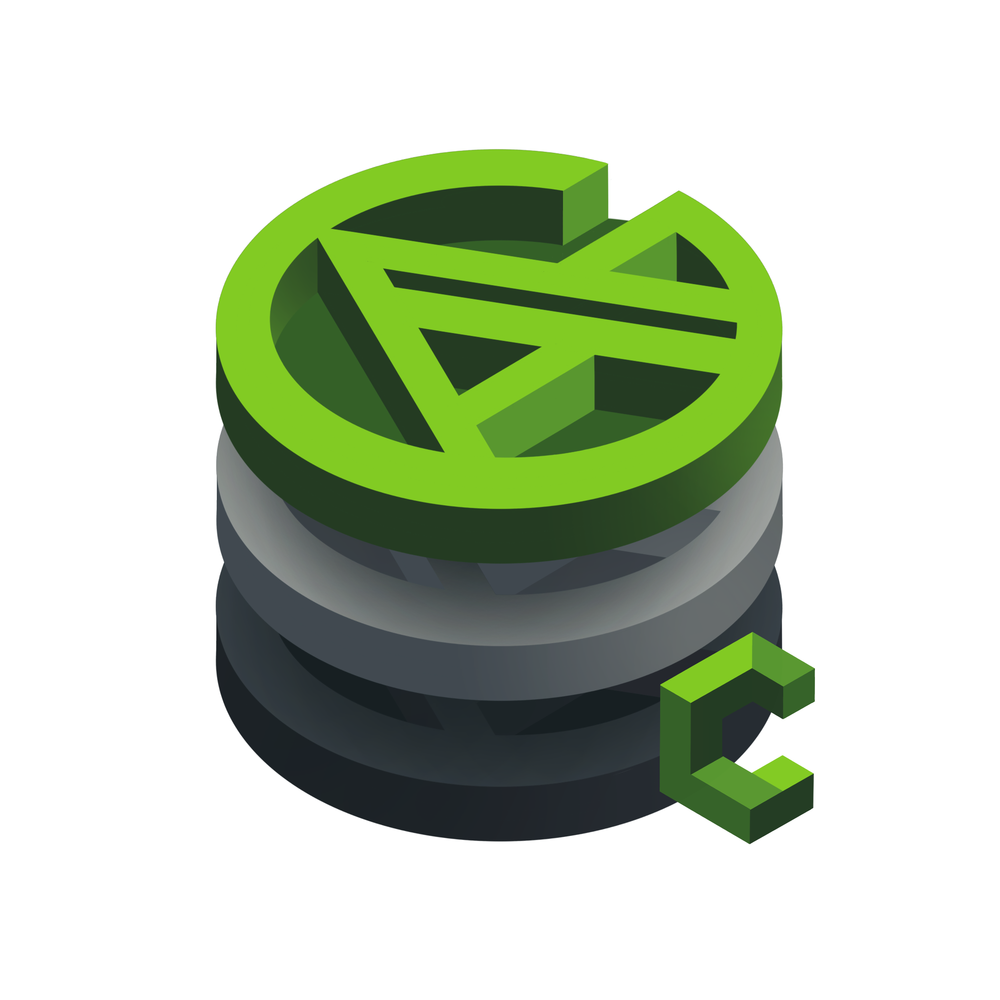
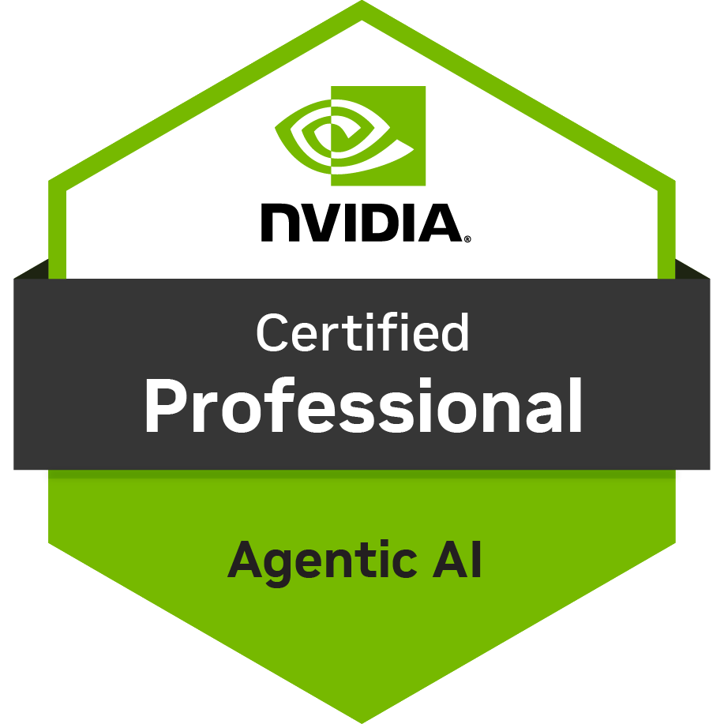
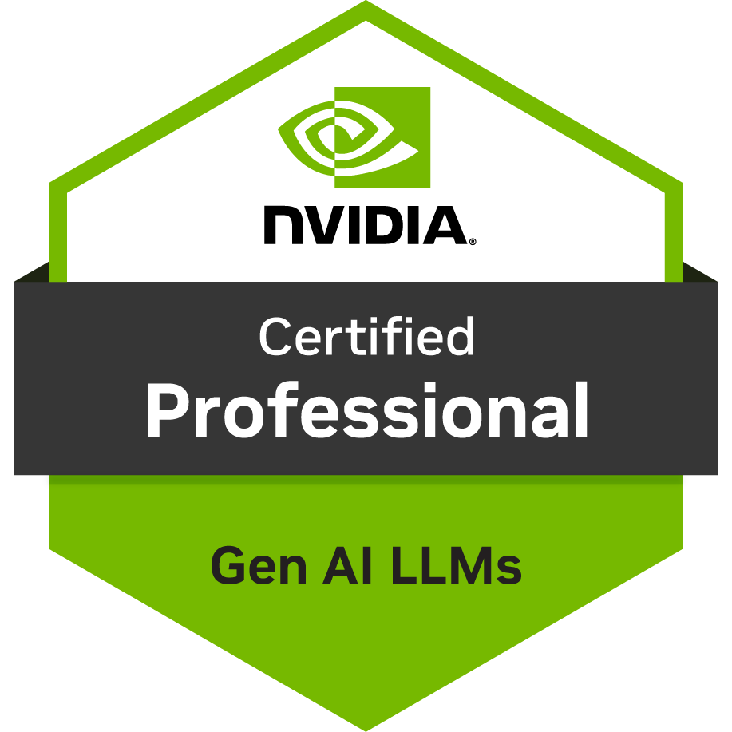
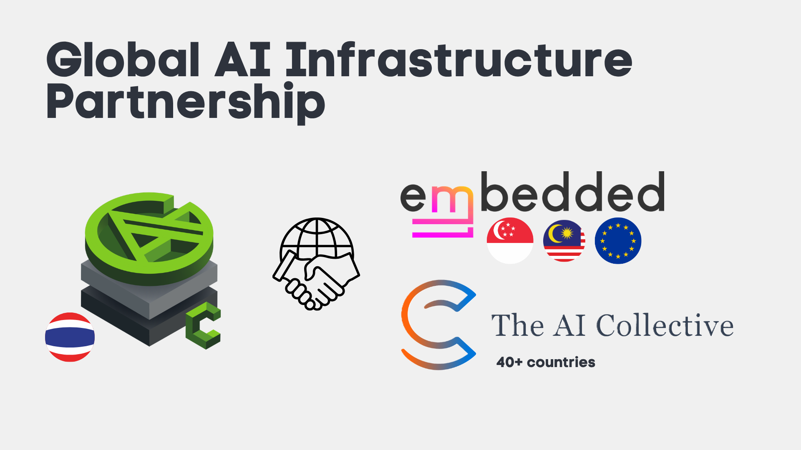

  

  # AGICAFET

  **Training | Consult | Implement**

  *"Anyone can run AI. We just run it faster, leaner, and cheaper."*

  > Bangkok-based AI startup delivering end-to-end AI solutions for government, state enterprises, and private organizations - from infrastructure to deployment.

   

  

   

  
  &nbsp;
  

---

## What We Do

| Service | Details |
|---------|---------|
| 🏢 AI Inhouse Training & Consult | Deep AI Training & Consulting for organizations · 10+ companies served |
| 🛠️ AI Implementation | End-to-end AI System Development · Gov, State enterprise & Private sector |
| 🔬 AI Research | 2 published papers · Production AI engineering 7+ years |
| 🎓 Academic Teaching | MSc students: London, USA, Chulalongkorn, KMUTT, CMU |
| 🎤 Conference Speaking | TensorFlow, Google, AWS, NVIDIA GTC, OpenCraft, vLLM |

---

## Global Partnership

  

> Partnering with **Embedded LLM (Singapore)** and **The AI Collective (40+ countries)** to bring cutting-edge AI infrastructure to the Thai market.

---

## Partners & Customers

<table>
  <tr>
    <td align="center"></td>
    <td align="center"></td>
    <td align="center"></td>
    <td align="center"></td>
    <td align="center"></td>
    <td align="center"></td>
  </tr>
  <tr>
    <td align="center"></td>
    <td align="center"></td>
    <td align="center"></td>
    <td align="center"></td>
    <td align="center"></td>
    <td align="center"></td>
  </tr>
  <tr>
    <td align="center"></td>
    <td align="center"></td>
    <td align="center"></td>
    <td align="center"></td>
    <td align="center"></td>
    <td align="center"></td>
  </tr>
  <tr>
    <td align="center"></td>
    <td align="center"></td>
    <td align="center"></td>
    <td align="center"></td>
    <td align="center"></td>
    <td></td>
  </tr>
</table>

---

## Research

- 📄 **Published Papers:** 2 peer-reviewed research publications
- 🧪 **Production AI Experience:** 7+ years building AI systems that ship

---

## Connect

| Channel | Link |
|---------|------|
| 🌐 Website | [agicafet.com](https://agicafet.com/) |
| 📘 Facebook | [ตื่นมาโค้ด Python by AGICAFET](https://www.facebook.com/profile.php?id=100063640873544) - 17K followers |
| 📧 Email | [natdhanai.pra@agicafet.com](mailto:natdhanai.pra@agicafet.com) |

---

## Tech Stack

**AI & LLM Ecosystem**

     

**Languages & Frameworks**

**Cloud & Infrastructure**

---

**AGICAFET**
*AI Solutions · Research · Engineering*

*Delivering AI that runs in production - for government, enterprises, and organizations across Thailand and beyond.*

  

---

